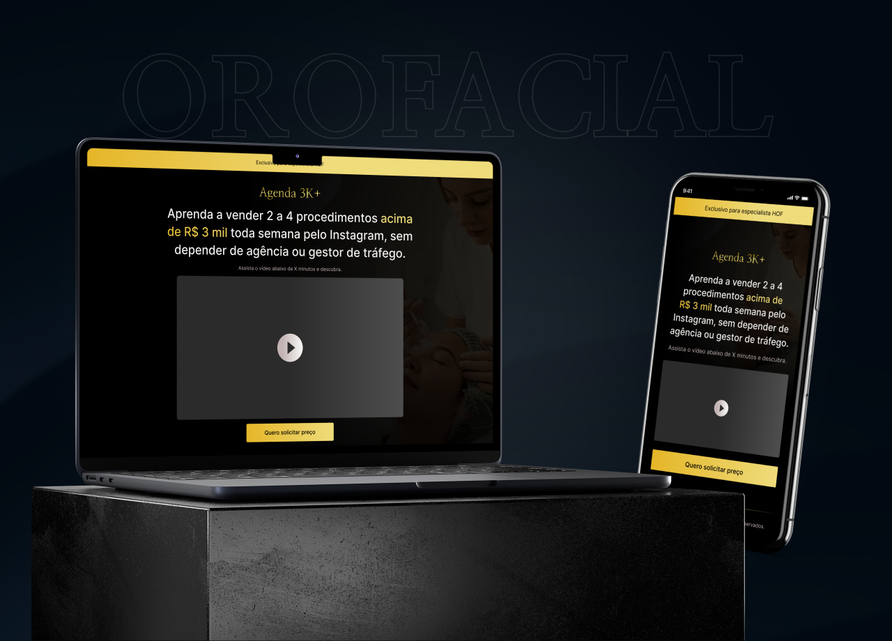

# Landing Page de Mentoria

Página criada com o objetivo de apresentar o método do especialsita e qualificar os leads para serem enviados para o atendimento no WhatsApp.

**Deploy:** https://hiigorsilva.github.io/samuel-lead/

## Paleta de Cores

| Cor               | Hexadecimal                                                |
| ----------------- | ---------------------------------------------------------------- |
| Black Main       |  #000000 |
| White Main       |  #F2F2F2 |
| White Medium       |  #DFD7D7 |
| White Gray       |  #C3B4B4 |
| Yellow Main       |  #E5B628 |
| Yellow Dark       |  #B69616 |
| Yellow Light       |  #EFDC7B |

## Tecnologias utilizadas

**Design:** Figma

**Front-end:** HTML, SCSS, CSS

**Controle de Versão:** GIT, GitHub
